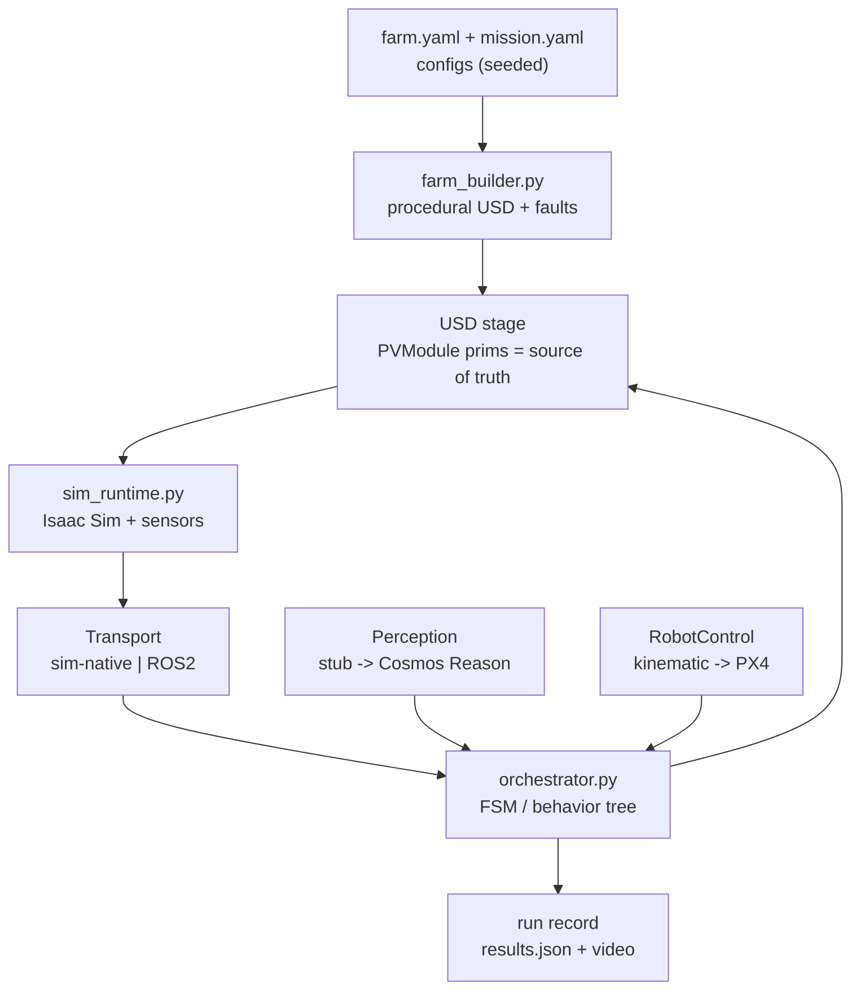
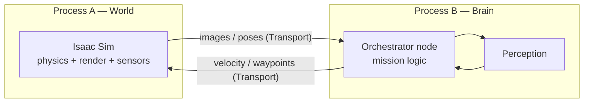

# PROJECT BIBLE — Autonomous Solar-Farm Inspection Digital Twin

**Status:** v0.1 · **Date:** July 2026 · **Owner:** (you)
**Companion docs:** `solar-inspection-digital-twin-plan.md` (the *strategy* — problem, vision, three worlds). · `STACK.md` (the full NVIDIA tool/library/model/MCP catalog, mapped to roles + adoption phase). · `CLAUDE.md` (operating rules for Claude Code — kept lean, points back here). This bible is the *execution* layer: how we actually build it, starting from nothing.

> **Read me first.** This is the single source of truth for *how* we build. When something here and the code disagree, fix one of them in the same commit. Sections 2, 6, and 8 are the load-bearing ones: the engineering principles, the contracts to lock early, and the day-by-day first sprint. Everything version-specific carries a **⚠ verify** note — Isaac Sim API names and asset paths shift between point releases, so confirm against *your* installed 5.1 build, never trust a snippet from memory (including these).

---

## 1. The vision in five sentences (recap)

We are building a living digital twin of a solar farm, not a robot demo. The twin is a georeferenced OpenUSD scene where every panel is a persistent object with state and history. A heterogeneous robot fleet (ground bots + screening drones + confirmation drones) is one *actuator* the twin commands; results flow back and update the twin, closing a predictive-maintenance loop. We build it across three "worlds" — Design/what-if, Data factory, Operational — that share the USD scene as their spine. Full strategic detail is in `solar-inspection-digital-twin-plan.md`; this bible assumes you've read it.

---

## 2. Guiding engineering principles (non-negotiable)

These are the "think out of the box, proper solutions" decisions that keep the ambitious version buildable. Violate them and the project rots into a pile of GUI clicks nobody can reproduce.

1. **Thin vertical thread before depth.** Slice 0 drives one ugly-but-complete path through all three worlds (§8). We never build one world "fully" before the others. The thread de-risks the *plumbing between worlds*, which is the real risk — not the AI, not the rendering.

2. **Everything is a script + a config. No GUI-only steps in the pipeline.** Anything that must be repeatable — building the farm, adding the ROS graph, injecting a fault, running a mission — is a Python entry point driven by a YAML/TOML config, runnable headless. GUI is for *inspection*, never for *construction*. This is what makes the project reproducible **and** what lets Claude Code actually run and iterate on it. If a step only exists as clicks in the Isaac Sim UI, it doesn't exist.

3. **The USD stage is the single source of truth for panel state.** Panel verdicts, history, and RUL live *on the USD prims* (§6.1), not in a side database. World 1 renders it, World 2 labels it, World 3 updates it. One object, three readers. A side DB comes later (World 3) and mirrors USD, never replaces it as truth during sim.

4. **Swappable interfaces at every seam.** Three abstractions, defined day one, each with a trivial first implementation and a clear upgrade:
   - **Perception** (`assess()` / `diagnose()`): stub reads ground-truth → later Cosmos Reason.
   - **Transport** (how the orchestrator gets sensor data + sends commands): *sim-native* (in-process annotator reads) → *ROS 2* (topics). Same interface both ways.
   - **RobotControl** (move base, fly drone): kinematic waypoint → later real controllers / Pegasus PX4.
   Nothing downstream should know which implementation is behind the interface.

5. **Decouple the simulator process from the orchestrator process.** Long-term, Isaac Sim (sim + sensors) runs as one process and the mission brain (behavior tree / FSM) runs as another, talking over the Transport. This mirrors real deployment (robot brain ≠ world) and forces clean contracts. For Slice 0 you *may* run single-process sim-native for speed, but keep the boundary in the code so the split is a config flip, not a rewrite.

6. **Test the logic without the simulator.** The mission logic must run against a `FakeSimBackend` (pure Python, no Isaac) so unit tests and CI don't need a GPU or Isaac Sim. Launching Isaac to test an `if fault: escalate` branch is a trap. This single decision keeps iteration fast and makes the orchestration Claude-Code-testable.

7. **Determinism and reproducibility.** Fixed seeds for procedural farm + fault injection. Pin tool versions (§7). Because the Spark stack is built from source, capture the exact commit/build in `docs/ENVIRONMENT.md`. A run should be replayable from `(config + seed + build)`.

8. **Every run emits a run record.** Each mission writes a `runs/<timestamp>/` folder: the config used, seed, a JSON of per-panel results (injected vs detected), timings, and (optionally) a recorded video. This is your demo material *and* your regression baseline.

---

## 3. Target platform reality (DGX Spark)

The Spark (GB10, aarch64, unified memory) is the **development bench**, not the whole factory. Design for it honestly.

**What runs on the Spark:** Isaac Sim 5.1 + Isaac Lab (built from source for aarch64), the twin authoring, the orchestrator, prototype-scale Cosmos Reason inference.

**Hard constraints to design around (⚠ verify against current NVIDIA notes):**
- aarch64 requires **CUDA ≥ 13** and the **cu13** build of PyTorch or newer. Isaac Sim is built from source and Isaac Lab symlinked to it (`_isaac_sim`).
- **Livestream is not supported** on the Spark → plan to inspect via the local GUI or by rendering to files/video, not remote streaming.
- **Cosmos Transfer1 is not currently supported** on the Spark → the heavy sim2real generation is a *burst-out* workload (RTX PRO 6000 / DGX / cloud via build.nvidia.com blueprints), not a Spark job.
- **Reported ROS 2 sensor-rendering quirks** on the Spark (camera topics not publishing / no publisher). **This is why Slice 0 defaults to the sim-native Transport** and treats ROS 2 as a seam we validate early but don't depend on until proven (§8, Day 1 + Day 9–11).

**Workload partition rule:** prototype (twin + policies + reasoning loop) on Spark; push large Replicator generation and all Cosmos world-model generation to bigger iron/cloud.

---

## 4. Architecture

### 4.1 The operational loop (target state)
Physical farm → living twin (USD) → predict + plan (Cosmos Reason + RUL) → dispatch fleet → fleet inspects/acts → updates twin. (Diagram + detail in the strategy doc, §7.)

### 4.2 Slice 0 component architecture (what we build first)



### 4.3 Runtime processes (target; single-process allowed for Slice 0)



---

## 5. Repository layout

Flat, boring, and obvious. This exact tree is what CLAUDE.md points at.

```
solar-twin/
├── CLAUDE.md                     # Claude Code operating rules (lean)
├── README.md                     # human quickstart
├── pyproject.toml                # deps for the pure-python parts (orchestrator, tests)
├── configs/
│   ├── farm.yaml                 # rows, cols, spacing, seed, fault rate
│   └── mission.yaml              # fleet, speeds, escalation thresholds
├── src/solar_twin/
│   ├── schema/
│   │   └── pv_module.py          # PVModule USD read/write helpers (§6.1)
│   ├── world/
│   │   ├── farm_builder.py       # procedural USD farm + fault injection
│   │   └── sim_runtime.py        # Isaac Sim launch, stepping, sensors
│   ├── transport/
│   │   ├── base.py               # Transport interface
│   │   ├── sim_native.py         # in-process annotator reads (default)
│   │   └── ros2_bridge.py        # ROS 2 topics (validated early, used later)
│   ├── perception/
│   │   ├── base.py               # Perception interface (assess/diagnose)
│   │   ├── ground_truth.py       # stub: reads USD state (Slice 0)
│   │   └── cosmos_reason.py       # later: VLM-backed
│   ├── control/
│   │   ├── base.py               # RobotControl interface
│   │   └── kinematic.py          # waypoint teleport/interp (Slice 0)
│   ├── orchestrator/
│   │   ├── mission.py            # the escalation FSM / behavior tree
│   │   └── fake_backend.py       # FakeSimBackend for logic tests
│   └── run.py                    # entry point: config -> run -> run record
├── tests/                        # pytest; run WITHOUT Isaac Sim
├── docs/
│   ├── PROJECT_BIBLE.md          # this file
│   ├── ARCHITECTURE.md           # deeper design notes (loaded on demand)
│   ├── ENVIRONMENT.md            # exact Spark build, versions, commit hashes
│   └── ROS2_CONTRACT.md          # the topic/message contract (§6.3)
├── assets/                       # small local USD/materials (NOT large binaries)
└── runs/                         # gitignored run records + videos
```

Two package roots on purpose: the **pure-python** parts (`orchestrator`, `perception` interfaces, `transport/base`, tests) import cleanly under any Python and run in CI; the **Isaac-bound** parts (`world/sim_runtime`, `transport/sim_native`, `transport/ros2_bridge`) only run under Isaac Sim's Python. Keep the Isaac import *inside* those modules so importing the logic never drags in Isaac.

---

## 6. Canonical contracts (LOCK THESE EARLY — §10 of the strategy doc)

Cheap to define now, brutal to retrofit. Everything else bends to these.

### 6.1 The `PVModule` — panel as a USD object
The one object shared by all three worlds. **Slice 0 approach:** plain custom attributes on an `Xform` prim (simplest, zero schema tooling). **Upgrade later:** a codeless *applied API schema* so the fields are typed and validated across the team.

Attribute set (namespaced under `pv:` to avoid collisions):

| Attribute | USD type | Meaning |
|---|---|---|
| `pv:panel_id` | `string` | stable ID, e.g. `R12-C047` |
| `pv:grid_index` | `int2` | (row, col) |
| `pv:geo_position` | `double3` | (lat, lon, elev) — georef anchor (§6.2) |
| `pv:state` | `token` | one of the fault taxonomy (§6.5) |
| `pv:iv_yield` | `float` | fraction of expected output (0–1) |
| `pv:rul_days` | `int` | predicted remaining useful life |
| `pv:last_inspected` | `string` | ISO timestamp |
| `pv:inspection_log` | `string[]` | append-only history |

Read/write helper sketch (**⚠ verify pxr calls against your build**):

```python
# src/solar_twin/schema/pv_module.py  (SKETCH — verify API)
from pxr import Usd, UsdGeom, Sdf, Vt

PREFIX = "pv"

def create_panel(stage: Usd.Stage, path: str, panel_id: str, row: int, col: int):
    prim = UsdGeom.Xform.Define(stage, path).GetPrim()
    prim.CreateAttribute(f"{PREFIX}:panel_id", Sdf.ValueTypeNames.String).Set(panel_id)
    prim.CreateAttribute(f"{PREFIX}:grid_index", Sdf.ValueTypeNames.Int2).Set((row, col))
    prim.CreateAttribute(f"{PREFIX}:state", Sdf.ValueTypeNames.Token).Set("healthy")
    prim.CreateAttribute(f"{PREFIX}:iv_yield", Sdf.ValueTypeNames.Float).Set(1.0)
    prim.CreateAttribute(f"{PREFIX}:inspection_log", Sdf.ValueTypeNames.StringArray).Set([])
    return prim

def set_state(prim, state: str, note: str):
    prim.GetAttribute(f"{PREFIX}:state").Set(state)
    log = list(prim.GetAttribute(f"{PREFIX}:inspection_log").Get() or [])
    log.append(note)
    prim.GetAttribute(f"{PREFIX}:inspection_log").Set(Vt.StringArray(log))
```

### 6.2 Coordinates & units
- **Stage up-axis: Z. Units: meters.** Set explicitly at farm build (`stage_utils.set_stage_up_axis("Z")` — ⚠ verify) and assert it on load. Mismatched up-axis/scale is the classic silent bug.
- **Georef mapping:** define one anchor — the farm origin `(0,0,0)` maps to a known `(lat, lon)` with a known heading. A panel's `geo_position` is derived from its metric position + the anchor. Put the anchor + a `local_to_geo()` function in `schema/` so World 2 (labels) and World 3 (real SCADA) resolve to the *same* panel. This is what makes a fault the drone finds at row 12 line up with the string SCADA is flagging.

### 6.3 The ROS 2 topic contract (the sim↔real seam)
Same interface carries simulated data (World 2) and real robot data (World 3). Full detail in `docs/ROS2_CONTRACT.md`; the spine:

| Topic | Type | Dir (from sim) | QoS |
|---|---|---|---|
| `/<robot_ns>/camera/image_raw` | `sensor_msgs/Image` | pub | **Sensor Data (Best Effort)** |
| `/<robot_ns>/camera/camera_info` | `sensor_msgs/CameraInfo` | pub | Sensor Data |
| `/<robot_ns>/cmd_vel` | `geometry_msgs/Twist` | sub | Reliable |
| `/<robot_ns>/pose` | `geometry_msgs/PoseStamped` | pub | Reliable |
| `/mission/fault` | `custom/FaultReport` (start: `std_msgs/String` JSON) | pub | Reliable |
| `/clock` | `rosgraph_msgs/Clock` | pub | — |

**Non-obvious gotcha (from NVIDIA docs):** Isaac Sim publishes images with **Sensor Data QoS**, so in RViz2 you must set the image display's Reliability to **Best Effort** or you'll see nothing. ROS 2 OmniGraph nodes only publish **after you press Play**. Namespacing: prefer per-robot namespaces; the auto-namespace feature can misbehave in deep hierarchies.

### 6.4 The Perception interface
```python
# src/solar_twin/perception/base.py  (SKETCH)
from dataclasses import dataclass

@dataclass
class Verdict:
    status: str          # "clean" | "suspect"
    confidence: float
    note: str

@dataclass
class Diagnosis:
    fault_type: str      # from taxonomy (§6.5)
    confidence: float
    note: str

class Perception:
    def assess(self, frame, panel_context: dict) -> Verdict: ...      # Drone 1 screening
    def diagnose(self, frame, panel_context: dict) -> Diagnosis: ...  # Drone 2 confirm
```
`ground_truth.py` ignores `frame` and reads `pv:state` from context (Slice 0). `cosmos_reason.py` (later) runs the VLM on `frame` with `panel_context` as the prompt.

### 6.5 Fault taxonomy (the `pv:state` enum)
Standardize now; it must match the strategy doc and eventually the SCADA fault codes.
`healthy` · `soiled` · `hotspot` · `crack` · `string_dropout` · `diode_fault` · `shading` · `unknown`.
Slice 0 uses a subset (`healthy`, `hotspot`, `soiled`). Adding a type = one enum entry + one visual signature + (later) one training-data recipe.

---

## 7. Tech stack & tooling (verified July 2026 — ⚠ confirm on your build)

This section is the **Slice-0-and-near-term core**. The full NVIDIA catalog — every library, model, service, and MCP mapped to its role and the phase we adopt it (Isaac ROS/Perceptor, Mission Dispatch, cuOpt, OSMO, NeMo Agent Toolkit, NuRec, Omniverse Libraries, Cosmos 3, the Isaac Sim MCP servers, and more) — lives in **`STACK.md`**. Read it when planning a phase; don't load it every session.

| Component | What / entry point | Notes |
|---|---|---|
| **Isaac Sim** | 5.1, built from source (aarch64) | Launch Python: `./python.sh script.py` from the build dir. `SimulationApp` import: `from isaacsim import SimulationApp`. |
| **Isaac Lab** | cloned + symlinked to Isaac Sim (`_isaac_sim`) | RL later (Phase: fleet policies). SKRL/JAX GPU path not validated on Spark. |
| **Core Python API** | `isaacsim.core.experimental.*`, assets via `isaacsim.storage.native.get_assets_root_path()` | Namespaces changed across 5.x — the `experimental` and `storage.native` modules are current in 5.1/6.0 docs; **verify**. |
| **ROS 2 bridge** | extension `isaacsim.ros2.bridge`; enable with `--enable isaacsim.ros2.bridge` or source ROS 2 first | Camera graph shortcut: **Tools > Robotics > ROS 2 OmniGraphs > Camera** (menu path varies by version). Nodes: `OgnROS2CameraHelper`, `OgnROS2CameraInfoHelper`. |
| **ROS 2 distro** | **Humble** assumed (Ubuntu 22.04) | ⚠ confirm what's installed on your Spark. |
| **Replicator (SDG)** | `import omni.replicator.core as rep`; semantic labels via `from isaacsim.core.utils.semantics import add_update_semantics` | Semantics API moved across 5.x; GUI fallback: **Tools > Replicator > Semantics Schema Editor**. Writer: `BasicWriter`. |
| **Robot assets** | under `<assets_root>/Isaac/Robots/…` | Nova Carter: `/Isaac/Robots/NVIDIA/NovaCarter/nova_carter.usd` (diff base, wheel r≈0.14, sep≈0.413; sensor-heavy). Jetbot / Carter v1 = lighter alternatives. **⚠ path layout shifted between 4.x and 5.x — verify.** |
| **Drone (Slice 0)** | kinematic Xform + camera, moved by `control/kinematic.py` | No flight dynamics; simplest thing that carries a camera along waypoints. |
| **Drone (Phase 2)** | **Pegasus Simulator v5.1.0** (matches Isaac 5.1) — PX4 + ROS 2, multirotor | Uses an `isaac_run` launch helper. Realistic flight when we need it. |
| **Cosmos** | Reason (~7B physical-AI VLM, the brain) · Transfer (sim2real, burst-out) · Predict (rare events). Now unified in **Cosmos 3** (May 2026): Nano ~16B / Super ~64B / Edge ~2B; open (OpenMDW 1.1) on HF; reason+predict+transfer+action in one model | Reason inference can prototype on Spark; Transfer/Predict generation = burst-out. ⚠ verify variant sizes/license. Full detail in `STACK.md` §2. |
| **Metropolis / VSS** | operational insight / video search + alerts | World 3 operator layer. |
| **Orchestration** | plain Python FSM first; **py_trees** (+`py_trees_ros`) if it grows | A behavior tree earns its place once escalation branches multiply. |
| **Ground nav (later)** | Nav2 via ROS 2 | Slice 0 uses scripted waypoints, not a nav stack. |

### 7b. Extended stack we deliberately adopt (summary — full catalog in `STACK.md`)
The pieces that turn the ambitious version from hand-rolled into leverage. Each is elaborated in `STACK.md` with the adoption phase:
- **Perception & nav for real robots:** *Isaac ROS* GEMs — **cuVSLAM** (visual-inertial SLAM), **nvblox** (3D reconstruction → costmap), **Isaac Perceptor** (AMR perception reference, lidar-free), **NITROS** (GPU ROS 2 transport), with **Nav2**. A power-plant *inspection-robot* reference already uses exactly this stack.
- **Fleet command & optimization:** **Mission Dispatch / Mission Client** (VDA5050-over-MQTT fleet task assignment, Nav2-integrated) for commanding many robots; **cuOpt** (open-source GPU **VRP/LP/MIP** solver) to compute the optimal coverage/route across the farm under battery + time-window + multi-depot constraints — routing becomes a solver, not a heuristic.
- **Data factory at scale:** **Physical AI Data Factory Blueprint** = **Cosmos + OSMO** (agentic orchestrator) to turn one scenario into thousands of variations; **Omniverse NuRec** (3D-Gaussian-splat real scans → sim) to build the twin from real farm captures.
- **Headless/agentic Omniverse:** **Omniverse Libraries** (`ovrtx`/`ovphysx`/`ovstorage`, headless-first, MCP-capable) — aligns with our scripted/decoupled principle; backs Isaac Lab 3.0 Beta.
- **Agent framework:** **NeMo Agent Toolkit** (framework-agnostic, MCP client+server) if the planner becomes a team of agents; serve models via **NIM**.
- **Interactive dev control (optional):** an **Isaac Sim MCP server** so Claude Code can drive the sim in natural language while iterating (see §10 and `STACK.md` §6).

---

## 8. SLICE 0 — the two-week vertical thread (day-by-day)

**Goal:** one row, one ground bot, one kinematic drone, ground-truth faults, a scripted escalation loop, one Perception verdict, results written back to USD and a run record emitted — end to end, headless-capable, on the Spark. Ugly and complete. **Needs no answers to the open questions in §13.**

**Transport for Slice 0:** `sim_native` (default), because of the Spark ROS 2 quirks. We *validate* the ROS 2 seam on Day 1 and build `ros2_bridge.py` on Days 9–11, but the thread does not depend on ROS 2 working.

Each day: **goal → tasks (checkboxes) → done-criteria**. Solo timing shown; with 2–3 people, Days 3–5 (scene) and 6–8 (robots) parallelize from Day 3 (~halves it).

### Day 1–2 — De-risk the scary seam; prove the sandbox
- [ ] Launch Isaac Sim 5.1 on the Spark; run a stock sample; confirm physics + rendering.
- [ ] Enable `isaacsim.ros2.bridge`; source ROS 2; publish a camera image from a sample scene; confirm you can see it (`ros2 topic list`, `ros2 topic echo`, or RViz2 with **Reliability = Best Effort**).
- [ ] Record the result in `docs/ENVIRONMENT.md`: does ROS 2 camera publishing work on *this* Spark? Note the build commit, ROS distro, driver/CUDA versions.
- **Done:** you know whether the ROS 2 camera path works. If yes, ROS 2 is a viable Transport later. If flaky, sim-native is confirmed as the Slice 0 path (as assumed) and you've logged the exact failure. Either outcome is a win — you're not guessing in week three.

### Day 3–4 — The panel becomes a real object
- [ ] Implement `schema/pv_module.py` (§6.1): create/read/write `PVModule` attributes.
- [ ] Implement `world/farm_builder.py`: from `configs/farm.yaml` (rows, cols, spacing, seed), procedurally place one row of ~10 panels (a textured box per panel is fine) on a Z-up meter grid; tag each with a `PVModule`.
- [ ] Assert stage up-axis/units on build; write the georef anchor + `local_to_geo()`.
- **Done:** `./python.sh -m solar_twin.world.farm_builder configs/farm.yaml` produces a USD with 10 queryable panels, state stored on the prims.

### Day 5 — Inject a fault as ground truth
- [ ] Flip 1–2 panels to `pv:state="hotspot"` (seeded) and give them a visible signature (distinct emissive material).
- [ ] Add a semantic label to faulted panels via `add_update_semantics` (⚠ verify) so Replicator segmentation *could* read them later.
- **Done:** the "cheat" is in place — a detector can read ground truth from USD/semantics without doing real vision yet. Logic and intelligence are now cleanly separable.

### Day 6–8 — Minimal robots
- [ ] Add a ground base from assets (start simple: Jetbot or Carter v1; Nova Carter if you want the ROS 2 samples, but it's sensor-heavy). Give it scripted waypoints down the row via `control/kinematic.py`.
- [ ] Add the "drone": a small Xform with a mounted camera; `control/kinematic.py` interpolates it along a per-panel inspection path.
- [ ] Implement `transport/sim_native.py`: read the drone camera frame in-process via the annotator/render-product API (⚠ verify) and expose poses.
- **Done:** both robots reach each panel in sim; you can grab the drone's camera frame in Python.

### Day 9–11 — Wire the escalation loop (stubbed) + build the ROS 2 seam
- [ ] Implement `perception/ground_truth.py` (reads `pv:state`) behind the `Perception` interface.
- [ ] Implement `orchestrator/mission.py`: the §8-strategy escalation flow — advance → screen (`assess`) → if suspect, `diagnose` → write result to the panel via `set_state` → append log → emit a fault event.
- [ ] Implement `orchestrator/fake_backend.py` + first pytest: run the whole mission logic with **no Isaac Sim** and assert escalation behaves.
- [ ] Build `transport/ros2_bridge.py` (camera sub, cmd_vel pub, pose, `/mission/fault`) per §6.3 — even if Slice 0 runs sim-native, get the seam implemented and, if Day 1 succeeded, smoke-test it.
- **Done:** the loop runs end-to-end sim-native; the same logic passes unit tests headless; the ROS 2 seam exists.

### Day 12–14 — Close it, measure, record
- [ ] Implement `run.py`: config → run mission → write `runs/<ts>/` (config, seed, `results.json` with injected-vs-detected per panel, timings).
- [ ] Confirm the USD reflects updated states + inspection logs after a run.
- [ ] (Optional) capture a video/gif of a run for the demo.
- [ ] Write `README.md` quickstart and update this bible + `CLAUDE.md` with anything you learned.
- **Done — Slice 0 complete:** `./python.sh -m solar_twin.run configs/farm.yaml configs/mission.yaml` drives the full thread and emits a run record showing 100% detection (it's ground truth). This is the spine everything else bolts onto.

**Definition of done for Slice 0 (one line):** a seeded, scripted, headless-capable run that inspects a row, escalates on injected faults, writes verdicts back onto the USD panels, and drops a reproducible run record — with the orchestration logic covered by tests that don't need Isaac Sim.

---

## 9. Beyond Slice 0 — deepen in dependency order

Never all at once. Each phase swaps one interface implementation or thickens one world.

- **Phase 1 — World 1 fidelity.** Real panel/rack SimReady-style assets; full farm from config (many rows); harden `PVModule` into a codeless applied schema; solidify georef. Add thermal/EL *signatures* (emissive/temperature proxies — Isaac Sim doesn't render true thermal, so fake the signature the confirm-drone reads). Stack: move sim orchestration onto the headless **Omniverse Libraries**; use **NuRec** to build twin patches from real farm scans; **Sensor RTX** for higher-fidelity sensors; swap the stub for **Cosmos Reason** as the brain (no orchestration change).
- **Phase 2 — World 2 data factory.** Replicator generates labeled frames (segmentation/bbox) from the scene with domain randomization; **burst-out** Cosmos Transfer turns cheap renders into photoreal/weather/dust variety; Cosmos Predict for rare failures. Train the first real detector, then swap the stub for `perception/cosmos_reason.py` — *no orchestration changes* (that's the point of the interface). Upgrade the drone to **Pegasus PX4** if realistic flight matters. Stack: adopt the **Physical AI Data Factory Blueprint (Cosmos + OSMO)** to scale generation off-Spark; serve Reason via **NIM**; start **Isaac Lab 3.0** policy training; use **Warp** for fast custom ops.
- **Phase 3 — World 3 operational loop.** Ingest telemetry (SCADA/weather/IV) into a store mirroring the twin; add RUL models that choose *what* to inspect; the twin auto-generates missions; add the **Metropolis/VSS** operator layer. Flip Transport to ROS 2 for the deployable path. Stack: **Isaac Perceptor** (cuVSLAM + nvblox + NITROS) + **Nav2** for real ground-bot autonomy; **Mission Dispatch/Client** to command the fleet; **cuOpt** to compute optimal inspection routes/coverage under battery + time-window constraints; **NeMo Agent Toolkit** if the planner becomes a multi-agent team; **Jetson Thor/Orin** at the edge on real robots. Now it's a closed loop.

---

## 10. The Claude Code workflow for this project

We use Claude Code throughout. `CLAUDE.md` (lean, <200 lines, loaded every session) holds the operating rules; this bible is the depth it points to. How to work well:

- **Bootstrap:** run `/init` in the repo to seed/refresh `CLAUDE.md` from the actual code, then hand-tune. Verify what's loaded with `/context` (look under **Memory files**); browse/edit memory with `/memory`.
- **Keep `CLAUDE.md` lean.** It's *context, not enforcement*. Put "every session" facts there (commands, layout, conventions, don'ts). Put depth here in `docs/` and reference it — do **not** `@import` this bible (it's big; imports load fully and burn context). Reference it as a plain path.
- **Path-scoped rules** for area-specific guidance: `.claude/rules/isaac.md` (Isaac API gotchas, ⚠-verify discipline) scoped to `src/solar_twin/world/**`; `.claude/rules/ros2.md` scoped to `transport/ros2_bridge.py`. These load only when Claude touches matching files.
- **Enforcement ≠ memory.** Anything that *must* happen (tests pass before "done", no commits to `main`) goes in tests / a **PreToolUse or pre-commit hook**, not just prose in `CLAUDE.md`.
- **Plan first on risky changes.** Use plan mode (and `ultrathink` for the highest reasoning budget) before edits to `world/` or `transport/`; those touch Isaac and are the expensive-to-fix areas.
- **Task tracking as checkboxes.** Keep the §8 day-by-day as `[ ]` items Claude can check off; keep a `docs/TASKS.md` for live work so sessions resume cleanly.
- **Auto memory is on** — Claude will accumulate build/debug notes in `~/.claude/projects/<repo>/memory/`. Review it occasionally with `/memory`; correct it when wrong.
- **(Optional) Isaac Sim MCP for a tighter loop.** A community **Isaac Sim MCP server** (e.g. `nullbyte91/nvidia-isaac-mcp`, which targets Isaac Sim 5.x + the `isaacsim.mcp.server` extension and lists Claude Code support) lets Claude Code drive the running sim in natural language — spawn a bot, add a camera, step frames, capture an image, hot-reload a controller — while you iterate on `world/`. **Treat it as a dev aid, not part of the reproducible pipeline** (our scripts + configs stay the source of truth), keep API keys out of the repo, and **⚠ verify it works on aarch64/Spark** before relying on it. Details + alternatives in `STACK.md` §6.

---

## 11. Testing & CI

- **Unit (no GPU, no Isaac):** orchestration logic against `FakeSimBackend`; schema read/write against an in-memory USD stage; `local_to_geo()` round-trips. These run in CI on any machine.
- **Smoke (Spark, manual/nightly):** launch Isaac headless, build the farm, run one mission sim-native, assert a run record is produced and detection == injected. Gate on exit code.
- **Rule:** logic changes ship with a unit test; "done" means the closest tests pass. Encode that as a hook so it's enforced, not hoped for.

---

## 12. Risks & mitigations

| Risk | Mitigation |
|---|---|
| ROS 2 sensor rendering flaky on Spark | Default to sim-native Transport; validate ROS 2 Day 1; keep it behind the interface so it's optional until proven. |
| Isaac API / asset paths drift between versions | ⚠-verify discipline everywhere; pin the build in `docs/ENVIRONMENT.md`; never trust remembered snippets. |
| No true thermal/EL rendering | Fake the *signature* (emissive/temperature-proxy + semantics) that the confirm-drone/model reads; real thermal is a domain-transfer problem for Phase 2. |
| Sim2real gap in perception | That's exactly what Cosmos Transfer + domain randomization address in Phase 2; seed with some real imagery to validate. |
| Scope creep (building a world "fully") | The thin-thread rule; Slice 0 gate before any depth. |
| Cosmos generation too heavy for Spark | Burst-out to bigger iron/cloud; Spark does Reason inference + orchestration only. |
| Reproducibility loss | Seeds + pinned versions + run records; config-driven everything. |

---

## 13. Open questions & assumptions

**Assumptions I'm making for Slice 0 (change any and tell me):**
- Language is Python throughout. Transport is sim-native first; ROS 2 is validated but not depended on. Drone is kinematic. Detector is a ground-truth stub. Fault subset = healthy/hotspot/soiled. One row, ~10 panels. Single-process allowed but the process boundary is kept in code.

**Questions that shape the build (grouped):**

*Environment / platform*
- Which **ROS 2 distro** is installed on your Spark (Humble? Jazzy?), and how do you currently launch Isaac Sim (`./python.sh`, a custom alias, Pegasus's `isaac_run`)?
- Did the Day-1-style ROS 2 camera check ever work on your Spark, or is that still unknown?

*Resourcing*
- **Solo or a small team?** (Decides whether Days 3–5 and 6–8 run in parallel.)
- Beyond the Spark, is there a bigger RTX/DGX box or cloud budget for the Phase-2 Cosmos/Replicator burst-out?

*Scope / product*
- Primary end-state target: **flagship demo / research artifact / real O&M product**? (Steers how much of World 3 we invest in.)
- Is there a **target farm, dataset, or customer**, or is this greenfield? (Affects georef realism and where real imagery to seed sim2real comes from.)

*Technical taste*
- Start orchestration as a **plain FSM** (my recommendation) and move to py_trees only if branches multiply — agree?
- Ground base preference for Slice 0: **simple (Jetbot/Carter v1)** vs **Nova Carter** (heavier but ROS-2-sample-rich)?

---

## 14. References (verify before committing to any version-specific detail)

- Isaac Sim 5.1 docs (ROS 2 bridge, Replicator, robot assets) — docs.isaacsim.omniverse.nvidia.com/5.1.0
- Isaac Lab install incl. DGX Spark constraints — isaac-sim.github.io/IsaacLab
- DGX Spark Isaac setup playbook — github.com/NVIDIA/dgx-spark-playbooks
- Pegasus Simulator v5.1.0 (Isaac 5.1, PX4) — github.com/PegasusSimulator/PegasusSimulator
- NVIDIA Cosmos (Reason / Transfer / Predict / Cosmos 3) — nvidia.com/en-us/ai/cosmos ; github.com/nvidia-cosmos
- Mega Omniverse Blueprint (fleets in facility twins) — blogs.nvidia.com/blog/mega-omniverse-blueprint-industrial-digital-twins
- Isaac Perceptor / cuVSLAM / nvblox — developer.nvidia.com/isaac/perceptor ; Nav2 tutorial: docs.nav2.org/tutorials/docs/using_isaac_perceptor.html
- Mission Dispatch / Mission Client (fleet mgmt) — developer.nvidia.com/blog/open-source-fleet-management-tools-for-autonomous-mobile-robots
- Omniverse Libraries (ovrtx/ovphysx/ovstorage + MCP) — developer.nvidia.com/blog/integrate-physical-ai-capabilities-into-existing-apps-with-nvidia-omniverse-libraries
- NeMo Agent Toolkit — developer.nvidia.com/agentiq ; github.com/NVIDIA/NeMo-Agent-Toolkit
- cuOpt (routing/optimization) — nvidia.com/en-us/ai-data-science/products/cuopt ; github.com/NVIDIA/cuopt
- Isaac Sim MCP servers — github.com/omni-mcp/isaac-sim-mcp ; lobehub.com/mcp/nullbyte91-nvidia-isaac-mcp
- Claude Code memory (CLAUDE.md conventions) — code.claude.com/docs/en/memory
- **Full NVIDIA stack catalog → `STACK.md`** · Strategy doc → `solar-inspection-digital-twin-plan.md`
