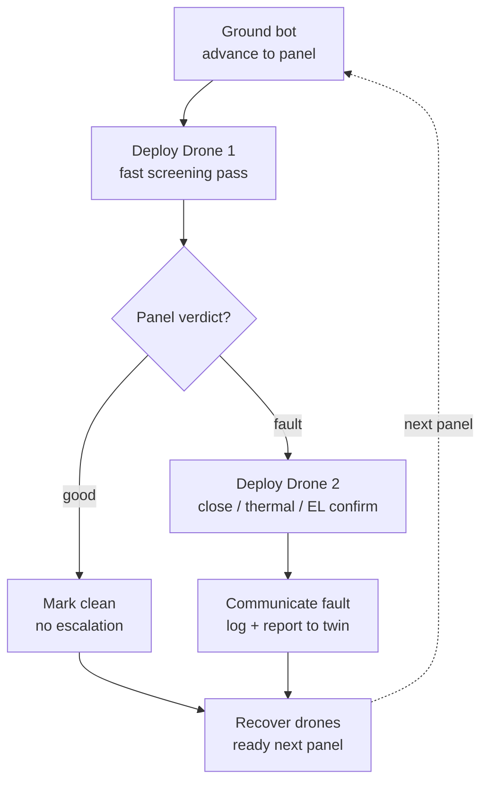
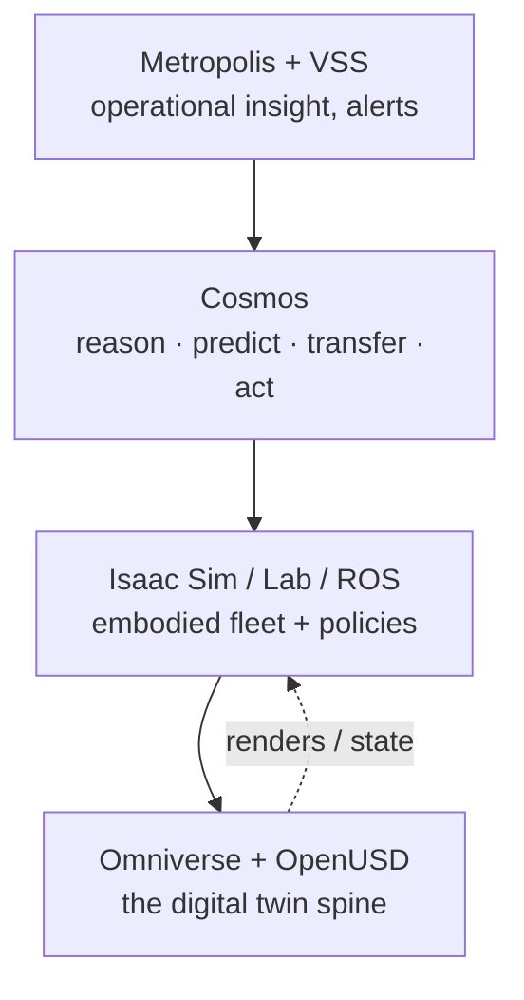
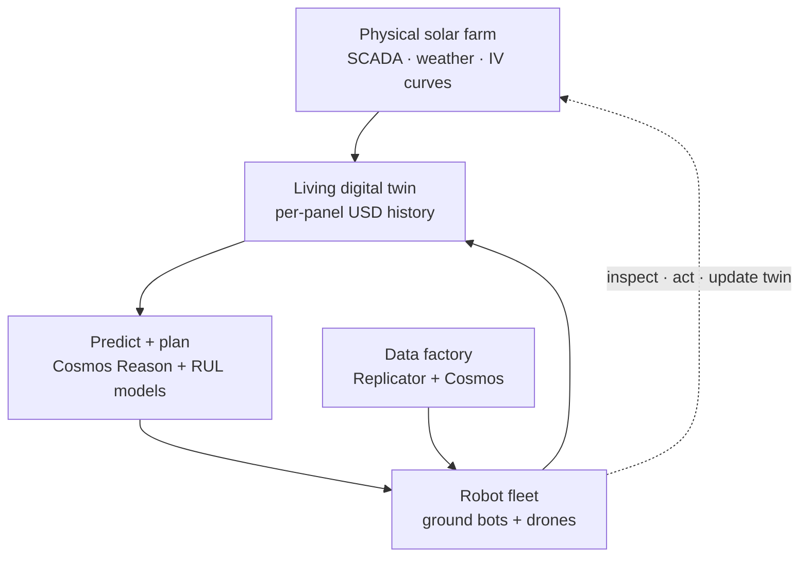
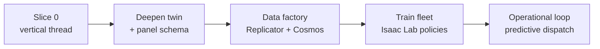

# Autonomous Solar-Farm Inspection — Digital Twin Program
### Plan · Architecture · Technology · Roadmap · Open Questions

**Version:** 0.1 (draft) · **Date:** July 2026 · **Platform in hand:** NVIDIA DGX Spark (GB10, aarch64) with Isaac Sim + Isaac Lab

> **One-line purpose:** Build a *living digital twin* of a utility-scale solar farm in which a heterogeneous robot fleet autonomously inspects panels, faults are detected and reasoned about, and the twin drives a closed maintenance loop — prototyped in simulation, transferred to reality.

---

## 0. How to read this document

This is the reference we align to and hand to anyone who needs the full picture. It moves from *why* → *what* → *how* → *when*:

1. The problem and why it matters
2. The reframe: from "a drone sim" to a living digital twin
3. The three worlds that make up the system
4. The full NVIDIA technology stack, mapped to concrete roles
5. The reasoning model (why a physical-AI VLM replaces a narrow detector)
6. Current industry solutions we can learn from and adopt
7. Architecture decisions to lock early
8. Worked examples
9. Hardware/deployment reality
10. Phased roadmap and the first sprint
11. Open questions

---

## 1. The problem

Utility-scale solar farms have tens to hundreds of thousands of panels spread across large, often remote sites. Panels degrade and fail in ways that quietly erode output: micro-cracks, hot-spots from failing cells or bypass diodes, string dropouts, soldering faults, soiling (dust/dirt), and vegetation shading. Left unfound, these compound and directly reduce energy yield and revenue.

Inspection today is **manual, periodic, and reactive**:

- Crews walk rows or fly drones on scheduled campaigns, then process imagery offline.
- Faults are usually found *after* they've already cost generation.
- Data lives in disconnected reports, not as a persistent, queryable record of each panel over time.
- The most diagnostic signals — thermal/infrared hot-spots and electroluminescence (EL) cell imaging — require specialized sensors and, for EL, night operations.

The opportunity is to make inspection **continuous, autonomous, and predictive**, and to keep a permanent per-panel history that supports both maintenance and warranty/insurance claims.

---

## 2. The reframe: this is not a robot sim, it is a living digital twin

The instinctive framing — "a ground robot deploys a drone that finds a bad panel" — is the *tail*, not the dog. The robots are one **actuator** of a larger system whose center of gravity is a digital twin of the farm.

**Digital twin** = a physically accurate, georeferenced virtual replica of the farm where every panel has a persistent identity, position, state, and inspection history. The twin is where we design, where we generate training data, and where operations actually run. Robots execute what the twin decides; results flow back and update the twin. The loop never stops.

This is where the whole industry is heading: AI that prescribes not just *when* to maintain but *how*, automatically triggering inspection or cleaning based on real-time forecasts — a closed-loop system for autonomous farm management.

### 2.1 The original robot concept (still correct, now a subsystem)

The two-tier escalation is a sound autonomy pattern. It becomes one behavior inside the twin:



**Why two tiers:** screening is cheap and fast (RGB, wide coverage); confirmation is expensive and precise (thermal/EL, close range). Escalating only on suspicion keeps the fleet efficient over large sites.

---

## 3. The three worlds

The program is best understood as three connected "worlds" that share one spine — the OpenUSD scene.

```mermaid
flowchart LR
    subgraph W1["World 1 — Design / What-if Twin (offline)"]
        A1["OpenUSD farm scene"]
        A2["Fleet + mission planning"]
        A3["Coverage / battery / layout tests"]
    end
    subgraph W2["World 2 — Data Factory (scale)"]
        B1["Replicator: labeled synthetic frames"]
        B2["Cosmos Transfer: sim to real"]
        B3["Cosmos Predict: rare events"]
        B4["Train perception + policies"]
    end
    subgraph W3["World 3 — Operational / Living Twin (online)"]
        C1["Real telemetry ingest"]
        C2["Predictive maintenance / RUL"]
        C3["Dispatch fleet"]
        C4["Ingest results, update twin"]
    end
    W1 --> W2 --> W3
    W3 -. "reality feedback" .-> W1
```



### World 1 — Design / what-if twin (offline)
The farm as an OpenUSD scene in Omniverse — not eye-candy, but a physically accurate testing ground for how the fleet behaves *before* touching hardware. Lay out rows, place SimReady panel assets, and test questions like "does the fleet cover 40 acres before batteries die?" The **Mega Omniverse Blueprint** is a directly relevant reference workflow: it simulates multi-robot fleets in industrial-facility digital twins, with Omniverse Cloud **Sensor RTX APIs** rendering camera / LiDAR / radar output against the USD stage.

### World 2 — Data factory (the part usually missed)
This is where scale and realism come from, and why the debate was never "YOLO vs VLM":

- **Synthetic data at scale** — Omniverse **Replicator** produces perfectly labeled camera/depth/segmentation frames for free (the sim knows which panel is faulted).
- **Sim-to-real** — **Cosmos Transfer** is a control-net-style world model that takes structured inputs (RGB, depth, segmentation) and performs Sim2Real / Real2Real translation. Author one dusty cracked-panel scene, multiply it into thousands of photoreal variants across lighting, haze, dust, and seasons.
- **Rare-event synthesis** — **Cosmos Predict** is a unified world model (Text2World / Image2World / Video2World) trained on ~200M clips, used to generate failures you can't wait to photograph (hail damage, spreading hot-spots, soiling patterns).
- **Training** — perception and navigation/coordination policies train against this data.

### World 3 — Operational / living twin (online, the real prize)
Real telemetry (SCADA, string-level IV curves, weather, prior inspections) flows into the twin. Predictive-maintenance models decide *what to inspect next* instead of blindly scanning everything. The twin dispatches the fleet, the fleet reports, the twin updates. That is the closed loop, shown in §7.

---

## 4. The NVIDIA technology stack, mapped to roles

| Layer | Product / tech | Role in this program |
|---|---|---|
| Twin substrate | **OpenUSD + Omniverse** | The georeferenced farm scene; the shared spine across all three worlds |
| Reference workflow | **Mega Omniverse Blueprint** | Multi-robot fleet simulation inside a facility digital twin |
| Sensor simulation | **Omniverse Cloud Sensor RTX APIs** | Physically accurate camera / LiDAR / radar rendering |
| Robot simulation | **Isaac Sim** | High-fidelity robot + physics simulation of bots and drones |
| Policy training | **Isaac Lab** | RL / learning environments for navigation, coverage, coordination |
| Robot runtime / bridge | **Isaac ROS + ROS 2 bridge** | The interface carrying sensor + control messages (sim *and* real) |
| Synthetic data | **Omniverse Replicator** | Auto-labeled training data with ground-truth fault masks |
| Sim-to-real | **Cosmos Transfer (2.5 / Cosmos 3)** | Photoreal + domain-varied data from cheap sim renders |
| World prediction | **Cosmos Predict (2.5 / Cosmos 3)** | Rare/failure scenario generation |
| Reasoning brain | **Cosmos Reason** | Physical-AI VLM: fault decisions, mission planning, auto-annotation |
| Policy generation | **Cosmos 3 (WAM) + Cosmos-RL** | Unified reasoning + prediction + action/policy generation |
| Operational insight | **NVIDIA Metropolis + VSS blueprint** | Visual AI agents: dense captioning, search, real-time alerts on footage |

> **Note on convergence:** NVIDIA is unifying these into **Cosmos 3** — a single model that can reason, predict future world states, transfer across domains, and generate actions/policies for embodied agents. Architect against the capabilities, not the individual model names, since they are consolidating.

### 4.1 Stack as layers



---

## 5. The reasoning model — why a physical-AI VLM, not just a detector

The early instinct is to bolt a narrow object detector (YOLO) onto the drone: bounding box → "fault." That is brittle and context-blind.

**Cosmos Reason** is an open, ~7B-parameter reasoning vision-language model built for physical AI. It uses prior knowledge, physics understanding, and common sense to reason about a scene and decide how to act, and it tops physical-reasoning benchmarks. In this program it plays **three roles at once**:

1. **Perception with judgment** — not "there is a dark region," but "this discoloration is soiling, not a cell fracture — do not escalate," or "this thermal signature is a bypass-diode fault — escalate to EL confirm."
2. **Mission planner** — post-trained into a high-level planner that decides inspection order and escalation, feeding the fleet.
3. **Data annotator/curator** — labels and curates the synthetic + real datasets that train the rest of the system.

This is the difference between a detector that fires labels and a brain that *understands the panel in context*.

---

## 6. Current industry solutions we can learn from and adopt

We are not inventing the domain — several commercial systems already prove pieces of this. We should deliberately borrow their proven patterns into our twin.

- **Per-panel identity + history** — leading platforms give every module a unique ID linked to inspection history, performance, and defect records. **Adopt:** this is our USD panel schema (§7, §8.1).
- **Georeferenced 3D digital twins** — platforms like Raptor Maps and Sitemark build georeferenced twins of plants from aerial/ground/sensor data. **Adopt:** lock georeferencing early so simulated and real faults land on the same panel.
- **Predictive maintenance / RUL** — models predict which panels fail next; published Remaining-Useful-Life accuracy is roughly 73–82% up to two months ahead. **Adopt:** this is the "decide what to inspect" engine of World 3.
- **Physics-informed AI on live plant data** — e.g. SmartHelio's Autopilot integrates with SCADA/CMS to build real-time twins and prioritize repairs without extra hardware. **Adopt:** the telemetry-ingest + prioritization pattern.
- **Multi-agent / edge autonomy** — e.g. ClearSpot's multi-agent system with drones + sensors + edge AI for detect/predict/optimize. **Adopt:** the heterogeneous-fleet-as-digital-workforce framing.
- **Night-shift EL mapping** — automated drone EL inspection detects cracks, dark cells, and soldering faults at high throughput (reported up to ~15,000 modules per 8-hour night shift, ~1 module/second). **Adopt:** thermal + EL sensing and night operations as first-class in the fleet design.
- **Copilot / dashboard layer** — e.g. SenseHawk's geospatial twin + copilot, MapperX audit workflows, vHive visualization. **Adopt:** the operator-facing layer maps to Metropolis + VSS.

**Net takeaway:** the commercial state of the art has each piece separately (twins, drones, RUL, dashboards). Our differentiator is uniting them into one *simulation-first, closed-loop* system using the NVIDIA physical-AI stack — designed and de-risked in the twin before it touches a real farm.

---

## 7. The closed loop (World 3 in detail)



**Reading it:** the physical farm streams telemetry into the twin; the twin plus predictive models decide what needs looking at; the fleet is dispatched (its perception/policies trained by the data factory); the fleet inspects/acts and reports back, updating the twin. Every cycle sharpens the RUL predictions.

### 7.1 The fleet becomes heterogeneous
Your two drones grow into a coordinated fleet the twin commands:

- **Ground bots** — mobile base, charging, comms relay, and drone garage.
- **Screening drones (Drone 1)** — fast, wide RGB coverage.
- **Confirmation drones (Drone 2)** — thermal / EL, close-range, often night ops.
- **Cleaning robots (later)** — dispatched when soiling forecasts cross a threshold.

---

## 8. Worked examples

### 8.1 Example — the panel as a USD object (the single most important schema)
Every panel is one persistent object that World 1 renders, World 2 labels, and World 3 updates. A sketch of the fields:

```
PVModule "panel_R12_C047"
  string   panel_id        = "R12-C047"
  double3  geo_position    = (lat, lon, elevation)
  int2     grid_index      = (row 12, col 47)
  token    state           = "healthy" | "soiled" | "hotspot" | "crack" | "string_dropout"
  float    last_ivyield    = 0.94        # fraction of expected output
  float    rul_days        = 47          # predicted remaining useful life
  asset    thermal_ref     = @textures/panel_R12_C047_thermal.exr@
  string[] inspection_log  = [ "2026-06-01 clean", "2026-07-15 hotspot flagged" ]
```

> If World 1 and World 3 disagree on what "a panel" is, the loop never closes. Define this on day one.

### 8.2 Example — escalation as behavior (pseudocode)

```
for panel in current_row:
    ground_bot.navigate_to(panel.approach_waypoint)
    screen = drone1.screen(panel)                 # fast RGB pass
    verdict = cosmos_reason.assess(screen, context=panel.history)
    if verdict.status == "clean":
        twin.update(panel, state="healthy")
    else:
        detail = drone2.confirm(panel)            # thermal / EL close pass
        fault  = cosmos_reason.diagnose(detail)
        twin.update(panel, state=fault.type, evidence=detail)
        comms.report(panel.id, fault)             # communicate the fault
    fleet.recover()
```

### 8.3 Example — sim-to-real data multiplication (Cosmos Transfer)
Author **one** scene: a panel with a diagonal micro-crack, mid-morning light. Feed its RGB + depth + segmentation to Cosmos Transfer with prompts:

- "same panel, harsh noon sun, heat shimmer"
- "same panel under monsoon overcast, wet surface reflections"
- "same panel with wind-blown dust film and low sun glare"

Output: thousands of photoreal, correctly-labeled training images from a single authored asset — variety you would never hand-model.

### 8.4 Example — reasoning vs. detecting (Cosmos Reason)
A drone image shows a dark blotch on a panel.

- *YOLO:* `class=anomaly, conf=0.71` → escalates (possibly a false alarm on bird droppings).
- *Cosmos Reason:* "Dark region is irregular and surface-level, consistent with soiling, not a thermal hot-spot; this panel's IV yield is normal and it was cleaned recently — classify as light soiling, monitor, do not dispatch Drone 2." → avoids a wasted confirmation flight.

### 8.5 Example — predictive dispatch (World 3)
Overnight, the twin ingests SCADA + weather. RUL models flag 6 panels in Row 12 trending toward failure within ~30 days, and a soiling forecast crosses threshold on Rows 3–5. At dawn the twin auto-generates a mission: confirm the Row-12 six with thermal/EL, and queue a cleaning pass on Rows 3–5 — no human tasking required.

---

## 9. Hardware and deployment reality

Think big, deploy realistically. **The DGX Spark is the development bench, not the whole factory.**

- **Runs well on Spark:** Isaac Sim + Isaac Lab (built from source for aarch64; requires CUDA ≥ 13 and a cu13 build of PyTorch), twin authoring, the orchestration logic, and Cosmos Reason inference at prototype scale.
- **Known Spark limits to design around:** Cosmos Transfer1 is not currently supported on the Spark; JAX GPU path and livestream are also not supported; and there are reported ROS 2 sensor-rendering quirks — so **prove the camera → ROS 2 path early**.
- **Burst elsewhere for scale:** large-scale Replicator generation and Cosmos world-model generation want bigger iron (e.g. RTX PRO 6000 / DGX) or cloud. The Omniverse + Cosmos blueprints on build.nvidia.com exist precisely to run these at scale.

**Partitioning rule:** prototype twin + fleet policies + reasoning loop on the Spark; push the data-factory and WFM generation to bigger hardware or cloud. Don't let the box's limits shrink the design.

---

## 10. Architecture decisions to lock early

These are cheap now and brutal to retrofit later:

1. **Panel data model** — the custom USD schema (§8.1). The one object shared by all three worlds.
2. **Georeferencing convention** — how real-world coordinates map into the USD stage, so a fault found at Row 12 lands on the same panel SCADA is complaining about.
3. **The sim↔real seam** — the ROS 2 topic/message contract, since the same interface carries simulated sensor data in World 2 and real robot data in World 3.

---

## 11. Phased roadmap

**Principle:** don't build the worlds sequentially (stall) or all-at-once in parallel (stall). Drive a **thin vertical thread** through all three first, then thicken each world in dependency order.



- **Slice 0 — Vertical thread (≈2 weeks, on Spark):** one row, one ground bot, one drone, ground-truth faults, scripted loop, one Cosmos Reason good/fault call — ugly but end-to-end. Proves the spine and shakes out the *plumbing between worlds* (the real risk).
- **Phase 1 — Twin fidelity:** harden the panel schema, georeferencing, realistic scene.
- **Phase 2 — Data factory:** Replicator labels → Cosmos Transfer for photoreal/weather/dust variety → Cosmos Reason as brain and annotator.
- **Phase 3 — Fleet policies:** train navigation/coverage/coordination in Isaac Lab against factory data.
- **Phase 4 — Operational loop:** turn on telemetry ingest + predictive maintenance dispatch; add Metropolis/VSS operator layer.

### 11.1 First sprint (Slice 0) — concrete
On the Spark: build a minimal USD farm (a handful of panels using the draft schema); drop in one existing Isaac ground-bot asset + a simple quadrotor; wire the ROS 2 bridge; inject a fault as a semantic tag; script the escalation loop end-to-end with a stubbed detector. Deliverable: the loop runs. Everything ambitious hangs off this spine.

---

## 12. Open questions

**Strategic**
- What is the primary end-state target: flagship demo, research artifact, or the seed of a real O&M product? (Changes where we invest first.)
- Is there a target farm / customer / dataset, or is this greenfield?

**Resourcing / hardware**
- Beyond the Spark, is there a bigger RTX/DGX box or cloud budget for Cosmos + Replicator scale-out?
- Solo effort or a small team? (Determines whether the three tracks run in parallel.)

**Technical / architecture**
- Fault sensing scope for the POC: RGB-only first, or thermal/EL from the start (implies night ops)?
- Do we run real ROS 2 in the loop from Slice 0, or a lightweight internal message bus first?
- Drone fidelity: kinematic waypoint drones (light) or full flight dynamics via a PX4/ArduPilot SITL bridge (realistic)?
- Ground-truth "cheat" detection first, then swap in Cosmos Reason — confirmed as the sequencing?

**Data / model**
- Where does initial real imagery come from to seed Cosmos Transfer / validate sim2real?
- What real fault taxonomy do we standardize on (matches the USD `state` enum)?

---

## 13. Glossary

- **OpenUSD** — Universal Scene Description; the open framework for composing the 3D twin.
- **Digital twin** — physically accurate, georeferenced virtual replica with persistent per-asset state.
- **Isaac Sim / Isaac Lab** — NVIDIA robot simulation platform / RL training framework on top of it.
- **Replicator** — Omniverse tool for generating auto-labeled synthetic training data.
- **Sensor RTX APIs** — physically accurate simulated camera/LiDAR/radar rendering.
- **Cosmos WFMs** — world foundation models: Predict (future states), Transfer (sim2real), Reason (physical VLM), converging into Cosmos 3 (adds action/policy generation).
- **Metropolis / VSS** — visual AI agent stack for video search, summarization, and alerts.
- **RUL** — Remaining Useful Life; predicted time before a panel fails.
- **EL** — Electroluminescence imaging; reveals cell cracks/defects, typically at night.
- **SCADA** — plant control/telemetry system providing live electrical data.

---

## 14. References (for follow-up)

- NVIDIA Cosmos (world foundation models overview) — nvidia.com/en-us/ai/cosmos
- Cosmos Predict/Transfer 2.5 and Cosmos 3 — github.com/nvidia-cosmos
- Cosmos world-simulation whitepaper — arxiv.org/abs/2511.00062
- Mega Omniverse Blueprint (multi-robot fleets in facility twins) — blogs.nvidia.com/blog/mega-omniverse-blueprint-industrial-digital-twins
- Simulating robots in industrial facility digital twins — developer.nvidia.com/blog/simulating-robots-in-industrial-facility-digital-twins
- Industrial facility digital twins (Omniverse + Metropolis) — nvidia.com/en-us/use-cases/industrial-facility-digital-twins
- Isaac Lab install notes incl. DGX Spark constraints — isaac-sim.github.io/IsaacLab
- DGX Spark Isaac setup playbook — github.com/NVIDIA/dgx-spark-playbooks
- Solar drone EL night mapping (throughput figures) — sinovoltaics.com
- Solar per-panel ID + RUL prediction — surgepv.com/blog/drone-inspection-solar-farm-thermal
- AI-in-solar landscape (Raptor Maps, SmartHelio, SenseHawk, ClearSpot, etc.) — omdena.com/blog/ai-in-solar-energy
