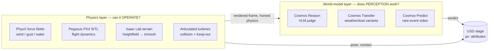

# 03 — Architecture

## Two-layer split: physics vs. world model

The core architectural insight from the research: this requires **two
complementary layers**, not one.

- **Physics-sim layer** (PhysX / Pegasus-PX4 / Isaac Lab) answers *"can the
  fleet OPERATE?"* — hold station in a gust, survive wake, avoid the swept
  blade volume, traverse graded terrain within battery/daylight windows.
- **World-model layer** (Cosmos Reason / Predict / Transfer) answers *"does
  PERCEPTION still WORK while it operates?"* — does Cosmos Reason still read a
  panel correctly under a blade shadow, motion blur, dust, low sun.

Physics tests the *body*; the world model tests the *eyes*. Both slot behind
the existing `Perception` / `Transport` / `RobotControl` interfaces, with the
USD stage remaining the source of truth for panel state (`NFR-03`).



## Six-pillar reference architecture

| ID | Pillar | Role | Primary stack | Runs |
|---|---|---|---|---|
| `PIL-1` | Photoreal neural-reconstructed twin | Turn the real site into a photoreal, geo-referenced USD scene | OpenUSD/Omniverse, NuRec/3DGUT, COLMAP, Cesium, Sensor RTX | Rendering: Spark. Reconstruction/training: burst-out unless `RISK-06` resolves |
| `PIL-2` | Physics that bites | Real flight dynamics, wind/wake, turbine collision+keep-out, traversable terrain, birds | PhysX + `omni.physx.forcefields`, Pegasus/PX4, USD articulations, Isaac Lab terrain | Spark-local (⚠ `RISK-02` Pegasus-on-aarch64) |
| `PIL-3` | Cosmos WFM data/scenario factory | Fan one seeded render into the long-tail (dust/haze/low-sun/shadow/bird) | Cosmos Transfer 2.5 + Predict 2.5 (→ Cosmos 3), Data Factory Blueprint + OSMO | Burst-out (Cosmos Transfer confirmed unsupported on Spark) |
| `PIL-4` | Closed-loop sim + policy training | Train/gate autonomy under domain-randomized conditions; measured KPIs before deployment | Isaac Lab (RL/IL, DR), closed-loop scenario suites | Training bursts out; Spark runs the interactive closed loop |
| `PIL-5` | Reason + act brains | Judge panels; longer-term, predict-and-act policies | Cosmos Reason 2 (vLLM/FP8) behind `Perception`; Cosmos Policy / GR00T-Dreams (research) | Reason inference on Spark via vLLM (sm_121 NIM workaround) |
| `PIL-6` | Real-robot deploy | Same interfaces re-implemented on metal | Isaac ROS 4.5 (cuVSLAM, nvblox, Perceptor, NITROS) + Nav2, cuOpt, Mission Dispatch/VDA5050/MQTT, Jetson Thor/Orin | Prototyping on Spark (nvblox/Isaac ROS support it; Mission Dispatch containers do not); real robots on-Jetson |

## Layered composition of the USD stage

Two things live in the same stage, at two different rates of change:

- **State layer (authoritative, changes every mission run):** panel `pv:`
  attributes, `FaultReport` events — owned entirely by `farm_builder.py` /
  `schema/pv_module.py`. This never moves, regardless of appearance fidelity.
- **Appearance layer (cosmetic, changes as fidelity graduates):** procedural
  boxes (Slice 0) → NuRec/3DGUT splat reconstruction of the real site
  (`SLICE-6`), referenced non-destructively alongside the procedural layer,
  with turbines/birds/robots composited as conventional kinematic USD assets
  on top (splats carry no collision geometry; see `HAZ-01`/`HAZ-02` in `05`).

```mermaid
flowchart TB
    subgraph Stage["USD stage (single source of truth)"]
        direction TB
        State["State layer\npv: attrs, FaultReport\n(owned by farm_builder.py)"]
        Appear["Appearance layer\nprocedural boxes → NuRec/3DGUT splats\n(referenced, non-destructive)"]
        Dyn["Dynamic composite\nturbines, birds, robots\n(kinematic/simulated USD assets)"]
    end
    State -. read/write via schema/pv_module.py .- Orchestrator
    Appear --> Render[Sensor RTX / ovrtx]
    Dyn --> Render
    Render --> Frame[camera frame]
    Frame --> Orchestrator[orchestrator/mission.py]
```

## Component-to-interface mapping (today → target)

This is the concrete answer to "how does six pillars of NVIDIA stack not
turn into a rewrite":

| Interface | Today (Slice 0) | Target impl | Pillar | What does NOT change |
|---|---|---|---|---|
| `Perception` | `ground_truth.py` (stub) | `cosmos_reason.py` (vLLM/FP8, wired) → later on-Thor Isaac ROS variant | PIL-5, PIL-6 | `assess`/`diagnose` signatures; `orchestrator/mission.py` FSM |
| `Transport` | `sim_native.py` (default, in-process) | `ros2_bridge.py` (VDA5050/MQTT bridge, per `docs/ROS2_CONTRACT.md`) | PIL-6 | `capture`/`pose`/`read_panel`/`write_panel`/`step` signatures |
| `RobotControl` | `kinematic.py` (teleport/interp) | Pegasus/PX4 SITL-backed impl | PIL-2 | `move_to`/`at_goal` signatures; `kinematic_math.py` stays as pure-python fallback/tests |
| Farm/state | `farm_builder.py` (procedural, authoritative) | Unchanged — owns panel IDs, `pv:` schema, fault injection | PIL-1 | Nothing; PIL-1's neural reconstruction is *added*, not substituted |

## Open-loop vs. closed-loop (where we are, where we're going)

- **Open-loop (current):** frames → VLM verdict → USD write. The world never
  reacts to the verdict within a run.
- **Closed-loop (target):** the controller reacts to gusts/wake, the camera
  re-renders, and a sweeping blade shadow must feed back into whether the
  *next* pass reads a false hotspot. This is the loop `HAZ-07` and `KPI-03`
  are built to catch. Closed-loop is delivered incrementally across
  `SLICE-2` (physics reacts) → `SLICE-3` (perception is tested against the
  reaction) → `SLICE-5` (a trained policy closes the loop under domain
  randomization).

## Runtime process shape

Slice 0 is single-process (Isaac Sim host process runs world + transport +
control; orchestrator and perception are pure-python modules imported into
it). The target multi-process shape (post `SLICE-8`) separates:

1. **Sim/world process** (Isaac Sim, GPU) — physics, rendering, `Transport`
   sim-native impl.
2. **Reasoning process** (vLLM serving Cosmos Reason) — today already
   out-of-process via HTTP, per `cosmos_reason.py`'s client design.
3. **Real-robot process(es)** (post-deploy, on-Jetson) — Isaac ROS stack,
   `ros2_bridge.py` Transport, on-Thor Cosmos Reason.
4. **Fleet-command process** (Mission Dispatch, cuOpt) — off-box or a
   supported Jetson, since Mission Dispatch containers are not yet
   Spark-supported (`RISK-08`).

No architectural decision here requires these to *not* run single-process
today; the point is that nothing in the interface design blocks the split
later.
